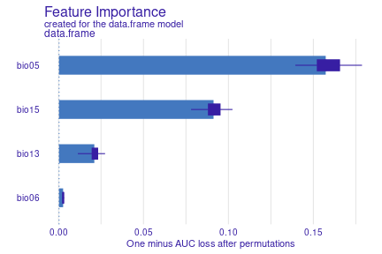
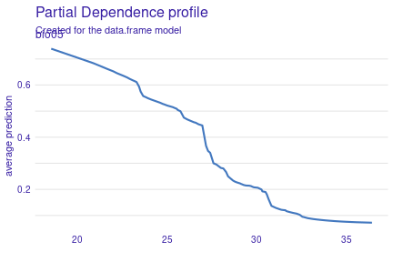
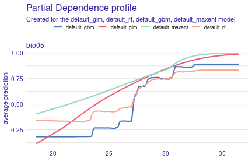
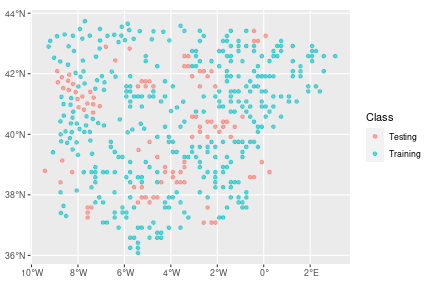
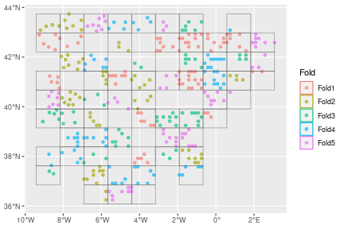
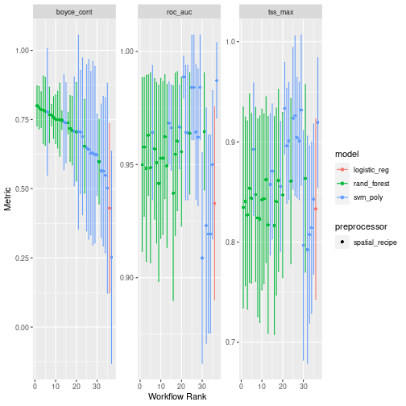
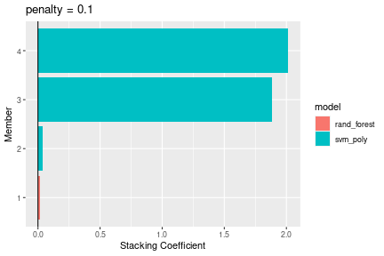
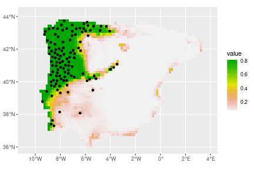

# Additional features of `tidymodels`

In this vignette, we illustrate how a number of features from `tidymodels` can
be used to enhance a conventional SDM pipeline. We recommend users first become familiar with `tidymodels`;
there are a number of excellent tutorials (both introductory and advanced) on its dedicated [website](https://www.tidymodels.org/)
We reuse the example on the Iberian lizard that we used
in the 
[`tidysdm` overview](https://evolecolgroup.github.io/tidysdm/articles/a0_tidysdm_overview.html) article.

# Exploring models with `DALEX`

An issue with machine learning algorithms is that it is not easy to understand the
role of different variables in giving the final prediction. A number of packages
have been created to explore and explain the behaviour of ML algorithms, such as those
used in `tidysdm`. In the [`tidysdm` overview](https://evolecolgroup.github.io/tidysdm/articles/a0_tidysdm_overview.html) article, we illustrated how to use `recipes` to create profiles.

Here we demonstrate how to use [DALEX](https://modeloriented.github.io/DALEX/), an excellent package
that has methods to deal with `tidymodels`. `tidysdm` contains additional functions that
allow use to use the DALEX functions directly on `tidysdm` ensembles. 

We will use a simple ensemble that we built in the 


```r
library(tidysdm)
lacerta_ensemble
#> A simple_ensemble of models
#> 
#> Members:
#> • default_glm
#> • default_rf
#> • default_gbm
#> • default_maxent
#> 
#> Available metrics:
#> • boyce_cont
#> • roc_auc
#> • tss_max
#> 
#> Metric used to tune workflows:
#> • boyce_cont
```

The first step in DALEX is to create an explainer object, which can then be
queried by different functions in the package, to turn the explainer into an
explanation (following the DALEX lingo). As a first step, we use the
custom function `explain_tidysdm` to generate our explainer:

```r
explainer_lacerta_ens <- explain_tidysdm(lacerta_ensemble)
#> Preparation of a new explainer is initiated
#>   -> model label       :  data.frame  (  default  )
#>   -> data              :  452  rows  4  cols 
#>   -> data              :  tibble converted into a data.frame 
#>   -> target variable   :  452  values 
#>   -> predict function  :  predict_function 
#>   -> predicted values  :  No value for predict function target column. (  default  )
#>   -> model_info        :  package tidysdm , ver. 0.9.2 , task classification (  default  ) 
#>   -> model_info        :  type set to  classification 
#>   -> predicted values  :  numerical, min =  0.0004084954 , mean =  0.238296 , max =  0.9561616  
#>   -> residual function :  difference between y and yhat (  default  )
#>   -> residuals         :  numerical, min =  -0.5010351 , mean =  0.01170401 , max =  0.6113744  
#>   A new explainer has been created!
```
Now that we have our explainer, we can explore variable importance for the ensemble:


```r
library(DALEX)
vip_ensemble <- model_parts(explainer = explainer_lacerta_ens)
plot(vip_ensemble)
```



Or generate partial dependency plots for a given variable (e.g. bio05):

```r
pdp_bio05 <- model_profile(explainer_lacerta_ens, N = 500, variables = "bio05")
plot(pdp_bio05)
```



There are many other functions in DALEX that can be applied to the explainer to
further explore the behaviour of the model; see
several tutorial on https://modeloriented.github.io/DALEX/

It is also possible to explore the individual models that make up the ensemble:

```r
explainer_list <- explain_tidysdm(tidysdm::lacerta_ensemble, by_workflow = TRUE)
#> Preparation of a new explainer is initiated
#>   -> model label       :  default_glm 
#>   -> data              :  452  rows  4  cols 
#>   -> data              :  tibble converted into a data.frame 
#>   -> target variable   :  452  values 
#>   -> predict function  :  yhat.workflow  will be used (  default  )
#>   -> predicted values  :  No value for predict function target column. (  default  )
#>   -> model_info        :  package tidymodels , ver. 1.1.1 , task classification (  default  ) 
#>   -> model_info        :  type set to  classification 
#>   -> predicted values  :  numerical, min =  0.004906125 , mean =  0.75 , max =  0.9990497  
#>   -> residual function :  difference between y and yhat (  default  )
#>   -> residuals         :  numerical, min =  -0.9678673 , mean =  -7.873284e-18 , max =  0.953622  
#>   A new explainer has been created!  
#> Preparation of a new explainer is initiated
#>   -> model label       :  default_rf 
#>   -> data              :  452  rows  4  cols 
#>   -> data              :  tibble converted into a data.frame 
#>   -> target variable   :  452  values 
#>   -> predict function  :  yhat.workflow  will be used (  default  )
#>   -> predicted values  :  No value for predict function target column. (  default  )
#>   -> model_info        :  package tidymodels , ver. 1.1.1 , task classification (  default  ) 
#>   -> model_info        :  type set to  classification 
#>   -> predicted values  :  numerical, min =  0 , mean =  0.7509861 , max =  1  
#>   -> residual function :  difference between y and yhat (  default  )
#>   -> residuals         :  numerical, min =  -0.5503262 , mean =  -0.0009860672 , max =  0.5657683  
#>   A new explainer has been created!  
#> Preparation of a new explainer is initiated
#>   -> model label       :  default_gbm 
#>   -> data              :  452  rows  4  cols 
#>   -> data              :  tibble converted into a data.frame 
#>   -> target variable   :  452  values 
#>   -> predict function  :  yhat.workflow  will be used (  default  )
#>   -> predicted values  :  No value for predict function target column. (  default  )
#>   -> model_info        :  package tidymodels , ver. 1.1.1 , task classification (  default  ) 
#>   -> model_info        :  type set to  classification 
#>   -> predicted values  :  numerical, min =  2.861023e-06 , mean =  0.7500019 , max =  0.9999918  
#>   -> residual function :  difference between y and yhat (  default  )
#>   -> residuals         :  numerical, min =  -0.1819368 , mean =  -1.920316e-06 , max =  0.08649289  
#>   A new explainer has been created!  
#> Preparation of a new explainer is initiated
#>   -> model label       :  default_maxent 
#>   -> data              :  452  rows  4  cols 
#>   -> data              :  tibble converted into a data.frame 
#>   -> target variable   :  452  values 
#>   -> predict function  :  yhat.workflow  will be used (  default  )
#>   -> predicted values  :  No value for predict function target column. (  default  )
#>   -> model_info        :  package tidymodels , ver. 1.1.1 , task classification (  default  ) 
#>   -> model_info        :  type set to  classification 
#>   -> predicted values  :  numerical, min =  0.1350514 , mean =  0.795828 , max =  0.9995933  
#>   -> residual function :  difference between y and yhat (  default  )
#>   -> residuals         :  numerical, min =  -0.8946667 , mean =  -0.04582804 , max =  0.561125  
#>   A new explainer has been created!
```

The resulting list can be then used to build lists of explanations, which can
then be plotted.


```r
profile_list <- lapply(explainer_list, model_profile,
  N = 500,
  variables = "bio05"
)
plot(profile_list)
```




# The initial split

The standard approach in `tidymodels` is to make an initial split of the data
into a test and a training set. We will use retain 20% of the data (1/5) for the testing set, and
use the rest for training.

We start by loading a set of presences and absences and their associated climate,
analogous to the one that we generated in the [`tidysdm` overview](https://evolecolgroup.github.io/tidysdm/articles/a0_tidysdm_overview.html) article:


```r
library(tidysdm)
library(sf)
lacerta_thin <- readRDS(system.file("extdata/lacerta_climate_sf.RDS",
  package = "tidysdm"
))
```

We then use `spatial_initial_split` to do the split, using a `spatial_block_cv`
scheme to partition the data:


```r
set.seed(1005)
lacerta_initial <- spatial_initial_split(lacerta_thin,
  prop = 1 / 5, spatial_block_cv
)
autoplot(lacerta_initial)
```



We can now extract the training set from our `lacerta_initial` split, and sample
folds to set up cross validation (note that we set the `cellsize` and `offset`
based on the full dataset, `lacerta_thin`; this allows us to use the same grid 
we used for the `initial_split`).

```r
set.seed(1005)
library(sf)
lacerta_training <- training(lacerta_initial)
lacerta_cv <- spatial_block_cv(lacerta_training,
  v = 5,
  cellsize = grid_cellsize(lacerta_thin),
  offset = grid_offset(lacerta_thin)
)
autoplot(lacerta_cv)
```



# Different recipes for certain models

Only certain type of models (e.g. glm, svm) struggle with correlated variables;
other algorithms, such as random forests, can handle correlated variables. So,
we will create two recipes, one with all variables, and one only with the
variables that are uncorrelated:


```r
lacerta_rec_all <- recipe(lacerta_thin, formula = class ~ .)
lacerta_rec_uncor <- lacerta_rec_all %>%
  step_rm(all_of(c(
    "bio01", "bio02", "bio03", "bio04", "bio07", "bio08",
    "bio09", "bio10", "bio11", "bio12", "bio14", "bio16",
    "bio17", "bio18", "bio19", "altitude"
  )))

lacerta_rec_uncor
#> 
#> ── Recipe ──────────────────────────────────────────────────────────────────────────────────────────────────────
#> 
#> ── Inputs
#> Number of variables by role
#> outcome:    1
#> predictor: 20
#> coords:     2
#> 
#> ── Operations
#> • Variables removed: all_of(c("bio01", "bio02", "bio03", "bio04", "bio07", "bio08", "bio09", "bio10", "bio11",
#>   "bio12", "bio14", "bio16", "bio17", "bio18", "bio19", "altitude"))
```

And now use these two recipes in a `workflowset` (we will keep it small for computational time),
selecting the appropriate recipe for each model. We will include a model (polynomial
support vector machines, or SVM) which does not have a wrapper in `tidysdm`
for creating a model specification. However, we can use a standard model spec from
`yardstick`:


```r
lacerta_models <-
  # create the workflow_set
  workflow_set(
    preproc = list(
      uncor = lacerta_rec_uncor, # recipe for the glm
      all = lacerta_rec_all, # recipe for the random forest
      all = lacerta_rec_uncor # recipe for svm
    ),
    models = list(
      # the standard glm specs
      glm = sdm_spec_glm(),
      # rf specs with tuning
      rf = sdm_spec_rf(),
      # svm specs with tuning
      svm = parsnip::svm_poly(
        cost = tune(),
        degree = tune()
      ) %>%
        parsnip::set_engine("kernlab") %>%
        parsnip::set_mode("classification")
    ),
    # make all combinations of preproc and models,
    cross = FALSE
  ) %>%
  # tweak controls to store information needed later to create the ensemble
  # note that we use the bayes version as we will use a Bayes search (see later)
  option_add(control = stacks::control_stack_bayes())
```


We can now use the block CV folds to
tune and assess the models. Note that there are multiple tuning approaches,
besides the standard grid method. Here we will use `tune_bayes` from the
`tune` package (see its
help page to see how a Gaussian Process model is used to choose parameter
combinations).


This tuning method (as opposed to use a standard grid) does not allow for
hyper-parameters with unknown limits, but
`mtry` for random forest is undefined as its upper range depends on the number of 
variables in the dataset. So, before tuning, we need to finalise `mtry` by 
informing the set dials with the actual data:


```r
rf_param <- lacerta_models %>%
  # extract the rf workflow
  extract_workflow("all_rf") %>%
  # extract its parameters dials (used to tune)
  extract_parameter_set_dials() %>%
  # give it the predictors to finalize mtry
  finalize(x = st_drop_geometry(lacerta_thin) %>% select(-class))

# now update the workflowset with the new parameter info
lacerta_models <- lacerta_models %>%
  option_add(param_info = rf_param, id = "all_rf")
```


And now we can tune the models:

```r
set.seed(1234567)
lacerta_models <-
  lacerta_models %>%
  workflow_map("tune_bayes",
    resamples = lacerta_cv, initial = 8,
    metrics = sdm_metric_set(), verbose = TRUE
  )
#> i	No tuning parameters. `fit_resamples()` will be attempted
#> i 1 of 3 resampling: uncor_glm
#> ✔ 1 of 3 resampling: uncor_glm (453ms)
#> i 2 of 3 tuning:     all_rf
#> ! No improvement for 10 iterations; returning current results.
#> ✔ 2 of 3 tuning:     all_rf (25.5s)
#> i 3 of 3 tuning:     all_svm
#> ✔ 3 of 3 tuning:     all_svm (41.3s)
```

We can have a look at the performance of our models with:


```r
autoplot(lacerta_models)
```



# Stack ensembles

Instead of building a simple ensemble with the best version of each model type, we
can build a stack ensemble, as implemented in the package `stacks`. Stacking
uses a meta-learning algorithm to learn how to best combine multiple models, including
multiple versions of the same algorithm with different hyper-parameters.


```r
library(stacks)
set.seed(1005)
lacerta_stack <-
  # initialize the stack
  stacks() %>%
  # add candidate members
  add_candidates(lacerta_models) %>%
  # determine how to combine their predictions
  blend_predictions() %>%
  # fit the candidates with non-zero weights (i.e.non-zero stacking coefficients)
  fit_members()

autoplot(lacerta_stack, type = "weights")
```



We can see that three versions of the SVM and one of the random forests were selected;
the stacking coefficients give an indication of the weight each model carries
within the ensemble. We can now use the ensemble to make predictions about the
testing data:


```r
lacerta_testing <- testing(lacerta_initial)

lacerta_test_pred <-
  lacerta_testing %>%
  bind_cols(predict(lacerta_stack, ., type = "prob"))
```

And look at the goodness of fit using some commonly used sdm metrics. Note that
`sdm_metric_set` is first invoked to generate a function (with empty `()`) that is then used
on the data.


```r
sdm_metric_set()(data = lacerta_test_pred, truth = class, .pred_presence)
#> # A tibble: 3 × 3
#>   .metric    .estimator .estimate
#>   <chr>      <chr>          <dbl>
#> 1 boyce_cont binary         0.803
#> 2 roc_auc    binary         0.992
#> 3 tss_max    binary         0.906
```

We can now make predictions with this stacked ensemble. We start by extracting the climate for the variables of interest


```r
download_dataset("WorldClim_2.1_10m")
climate_vars <- lacerta_rec_all$var_info %>%
  filter(role == "predictor") %>%
  pull(variable)

climate_present <- pastclim::region_slice(
  time_ce = 1985,
  bio_variables = climate_vars,
  data = "WorldClim_2.1_10m",
  crop = iberia_poly
)
```


```r
prediction_present <- predict_raster(lacerta_stack, climate_present,
  type = "prob"
)
library(tidyterra)
ggplot() +
  geom_spatraster(data = prediction_present, aes(fill = .pred_presence)) +
  scale_fill_terrain_c() +
  # plot presences used in the model
  geom_sf(data = lacerta_thin %>% filter(class == "presence"))
```




